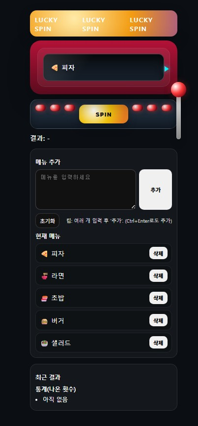

# 🎰 Random Slot Machine

HTML + CSS + Vanilla JavaScript 기반으로 제작한
메뉴 커스터마이징이 가능한 랜덤 슬롯 머신 웹 페이지입니다.

사용자가 직접 항목을 추가하여 슬롯을 돌릴 수 있으며,
최근 결과 히스토리와 항목별 등장 통계를 제공하도록 구성했습니다.

애니메이션 기반 슬롯 연출과 사운드 효과를 통해
간단하지만 몰입감 있는 인터랙션을 목표로 제작했습니다.

## 🌐 배포 주소

Vercel을 통해 배포되었습니다.

👉 https://random-slot-machine.vercel.app/

# ✨ 주요 기능

## 🎰 슬롯 실행

- SPIN 버튼 / 레버 클릭으로 슬롯 회전

- 2단 감속 애니메이션 적용

- 슬롯 사운드 효과

## ➕ 메뉴 관리

- 메뉴 직접 추가

- 줄바꿈 / 쉼표 입력으로 여러 항목 동시 등록

- Ctrl + Enter 빠른 추가

- 최소 2개 이상일 때만 실행 가능

## 📊 결과 관리

- 최근 결과 히스토리 (최대 10개)

- 항목별 등장 횟수 통계 표시

## 💾 데이터 유지

- localStorage 기반 메뉴 자동 저장

- 새로고침 / 재방문 시 유지

## 🛠 사용 기술

- HTML

- CSS

- Vanilla JavaScript

- Web Audio API

- localStorage

- Vercel

## 📂 프로젝트 구조

```
random-slot-machine/
├─ index.html
├─ style.css
├─ style.scss
├─ app.js
└─ README.md
```

## 🚀 실행 방법 (로컬)

index.html 파일을 브라우저로 열거나
VS Code Live Server 사용을 권장합니다.

## 🎨 UI 컨셉

단일 슬롯 중심 인터페이스

레버 기반 조작 방식

결과 카드 / 통계 패널 분리

심플한 다크 테마 UI

## 📸 Preview



## 📌 앞으로 추가해보고 싶은 기능

- 슬롯 개수 선택

- 확률 가중치 설정

- 애니메이션 옵션 조절

- 결과 CSV export

- 모바일 전용 UI 개선

## 🙋‍♀️ 제작자 GitHub

https://github.com/sungminjung066-lang
